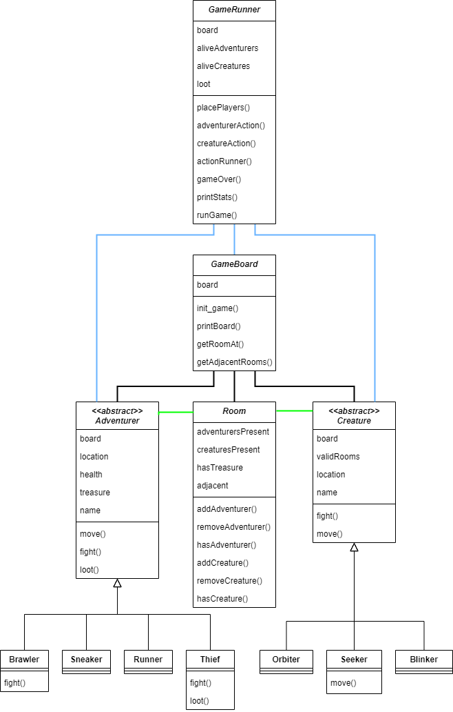

# CSCI-4448-Project2.2 

## Team Members:  
Cesser Jackson  
Ricardo Gonzalez  

## Java Version:  
Cesser's:  

Ricardo's:  
openjdk version "17.0.4" 2022-07-19  
OpenJDK Runtime Environment (build 17.0.4+8-Ubuntu-120.04)  
OpenJDK 64-Bit Server VM (build 17.0.4+8-Ubuntu-120.04, mixed mode, sharing)  

## Assumptions:  
- Since Orbiters were specified to "circle the outer Rooms of the level they are on, whether connected or not," Orbiter movement simply chooses a different outer room on its current level and moves there.  
- Since the game was ending very easily when rooms were able to be looted multiple times, treasure is not able to be found in the same room more than once.  
- At the beginning of the game a key was put in so Adventurers and Creatures could easily be distinguished.  

## RotLA UML Diagram update:  
  
The overall class structure remains unchanged, but every class has a few more attributes and methods to create a working game. The Sneaker and Runner subclass don't have any unique methods since their bonus is dealt with in GameRunner's adventurerAction(). Orbiter and Blinker share a movement function in this implementation, so they don't have a unique move method either. Room's checkRoom() split into hasAdventurer() and hasCreature(), and its other methods were added to update its new attributes. GameBoard's init_game() is basically a constructor to populate its board attribute, and drawLevel() became printBoard(). The other two methods are helper functions for several methods throughout the program. GameRunner's new attributes keep track of the game state and its new methods perform the following. placePlayers() populates the board with both Adventurers and Creatures, printStats() shows the current status of Adventurers and Creatures, and runGame() is the final method that loops through the game until victory (or loss) conditions are met.
