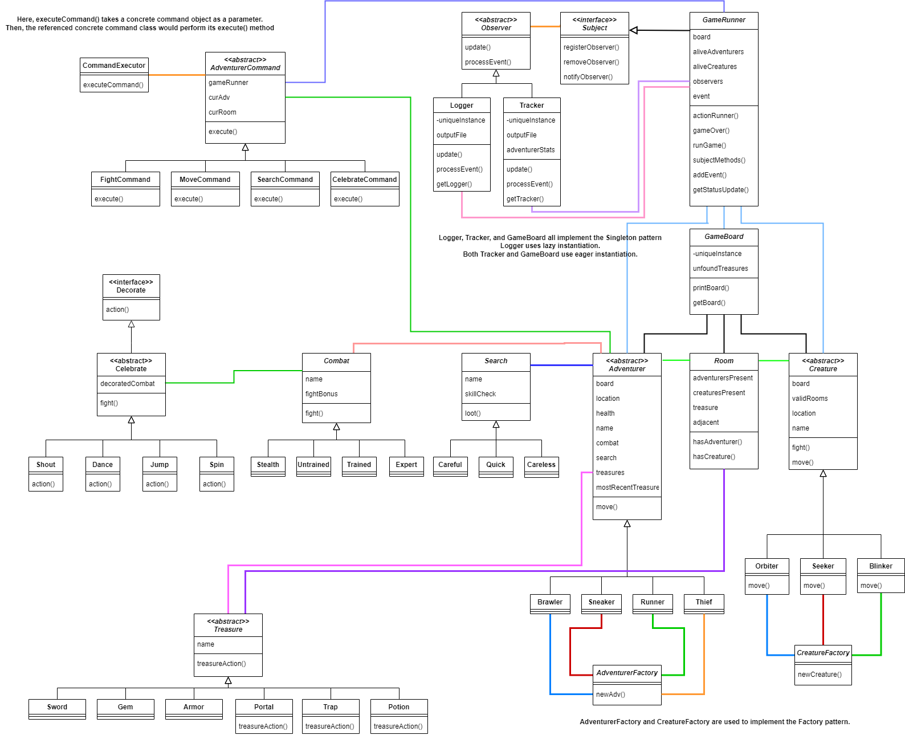

# CSCI-4448-Project 4.2  

## Team Members:  
Cesser Jackson  
Ricardo Gonzalez  

## Java Version:  
openjdk version "17.0.4" 2022-07-19  
OpenJDK Runtime Environment (build 17.0.4+8-Ubuntu-120.04)  
OpenJDK 64-Bit Server VM (build 17.0.4+8-Ubuntu-120.04, mixed mode, sharing)  

## Assumptions:  
- Search is available in all rooms that contain a treasure, but an Adventurer can still only hold one of each treasure. Because of this, searching a room that contains a treasure that's owned essentially wastes the turn.  
- The game currently ends immediately if the player chooses not to move on their first turn.  
- Runners will still take escape damage on their first movement if applicable. Their second movement in the same turn is guaranteed to avoid all escape damage.  

## RotLA UML Diagram update:  
  
The biggest change between the UML for 4.1 and 4.2 is the Command pattern. Instead of having the existing Celebrate, Combat, and Search classes implement a Command interface, an abstract class AdventurerCommand with its own concrete command classes was created. The execute method of these concrete command classes, with the exception of MoveCommand, uses methods defined in GameRunner that already had the desired behavior of each command. CommandExecutor serves as an invoker for commands. Additionally, both Factory classes now use Simple Factory instead of implementing subclasses for Factory since both Adventurers and Creatures don't have any extra behaviors to set. Aside from that, there were many little changes to some existing classes like dropping/renaming attributes and refactoring existing methods.  