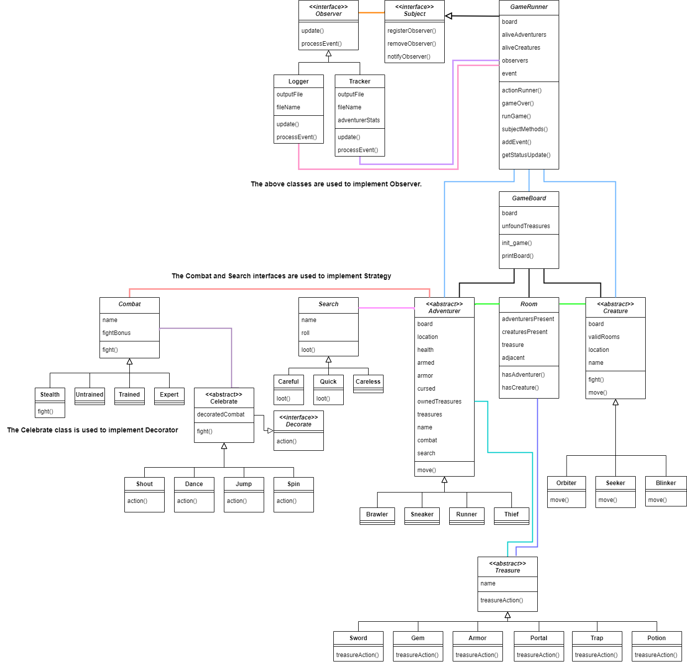

# CSCI-4448-Project 3.2  

## Team Members:  
Cesser Jackson  
Ricardo Gonzalez  

## Java Version:  
openjdk version "17.0.4" 2022-07-19  
OpenJDK Runtime Environment (build 17.0.4+8-Ubuntu-120.04)  
OpenJDK 64-Bit Server VM (build 17.0.4+8-Ubuntu-120.04, mixed mode, sharing)  

## Assumptions:  
- Portals have a 1/3 chance of being used each adventurer turn, and they aren't removed upon use.
- Since observers are implemented after initialization, the starting rooms of all players isn't published.  
- Currently, celebrations are only printed to the console. Observers know when a celebration occurs, but don't have access to the message.

## RotLA UML Diagram update:  
  
Instead of interfaces, both Combat and Search became classes. Because of this, many children don't have to implement the fight or loot methods. The biggest change here is the Celebrate class using the Decorate interface instead of the Combat class. It still maintains a reference to Combat, but is no longer its child. Adventurer gained more attributes to keep track the effects of treasures. Concrete Treasures now have a treasureAction method to use a treasure when it's attained, except the Portal. GameBoard has a new unfoundTreasures attribute to know which treasures remain for the "All Treasures found" game end. Aside from that, everything related to the Observer and Subject became more defined.